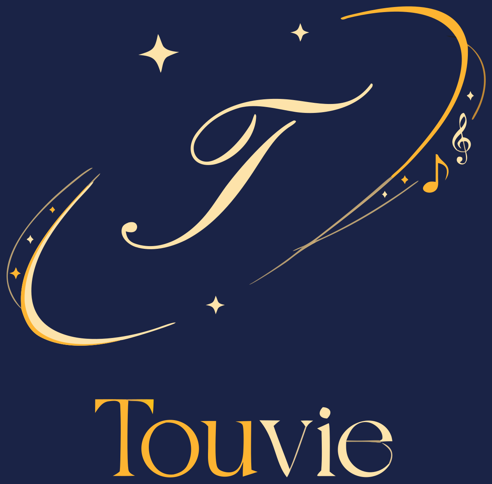
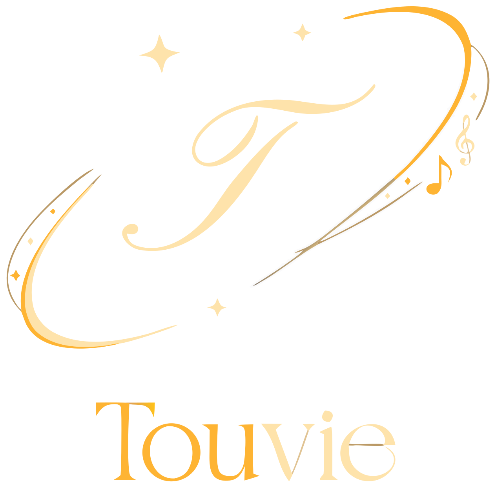

# Marca Touvie

> **Monograma Celeste** — o "T" caligráfico orbitado por quatro elipses (átomo / flor cósmica), uma delas ondulando numa **fita melódica** com notas. *A imensidão de uma vida, reunida num lugar só — que canta.*

<table>
  <tr>
    <td align="center"></td>
    <td align="center"></td>
  </tr>
  <tr>
    <td align="center"><code>touvie-logo.svg</code> detalhada · fundo navy · 55 formas</td>
    <td align="center"><code>touvie-logo-alt.svg</code> enxuta · 38 formas</td>
  </tr>
</table>

## Ficha técnica
- **Formato:** SVG vetorial (`viewBox 0 0 1024 1024`) — escala infinita, sem perda, do favicon ao outdoor.
- **Paleta:** navy `#08112E` (fundo) · navy elevado `#161F4A` · ouro `#E0B83E` → ouro-claro `#F5DD8E` (gradiente) · creme `#F2E6C2`.
- **Conceito:** "T" + 4 órbitas + estrela de 4 pontas + fita melódica — eco do cursor do app que toca dó-ré-mi ("até o cursor canta").
- **Wordmark:** *Touvie* em serifa editorial (Instrument Serif, a fonte de título do app).

## Uso
- Preferir sempre **fundo escuro / navy** — é onde a marca brilha.
- **Não** distorcer, girar nem recolorir fora da paleta.
- Manter respiro generoso ao redor (área de proteção ≈ a altura do "T").
- Para favicon (16–32 px), derivar uma versão simplificada (só o "T" + uma órbita) — a fazer.

## Arquivos
| Arquivo | O que é |
|---|---|
| [`touvie-logo.svg`](touvie-logo.svg) | Versão principal — detalhada, com fundo navy. |
| [`touvie-logo-alt.svg`](touvie-logo-alt.svg) | Versão enxuta — menos formas, mais leve. |

---
*Masters vetoriais da marca — versionados aqui pra nunca mais se perder. Conceito desenvolvido em jun/2026; arte assistida por IA, vetorizada e curada. Direção de marca registrada na memória do projeto (Monograma Celeste).*
