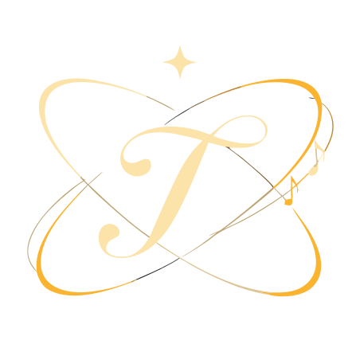

# Touvie — marca

O **Monograma Celeste**: o "T" caligráfico dourado varrido por uma órbita-cometa,
com estrelas de 4 pontas, notas musicais e a clave de sol na ponta da órbita —
a imensidão (o céu) e "um lugar só" (o emblema), com a música do "cursor que
canta". Montagem final do autor (2026-06-11), vetorial pura.

<table>
  <tr>
    <td align="center"></td>
    <td align="center"></td>
  </tr>
  <tr>
    <td align="center"><code>touvie-logo-alt.svg</code> lockup · transparente</td>
    <td align="center"><code>touvie-mark.svg</code> só o emblema</td>
  </tr>
</table>

## Arquivos

| Arquivo | O que é |
| --- | --- |
| [`touvie-logo.svg`](touvie-logo.svg) | Lockup completo (emblema + "Touvie") **com fundo navy**. Fonte da OG image. |
| [`touvie-logo-alt.svg`](touvie-logo-alt.svg) | Lockup completo **transparente** — login, materiais sobre qualquer fundo. |
| [`touvie-mark.svg`](touvie-mark.svg) | Só o emblema, transparente (paisagem ~1.4:1) — header, footer. |
| [`touvie-mark-bg.svg`](touvie-mark-bg.svg) | Só o emblema, com fundo navy. |
| [`touvie-icon.svg`](touvie-icon.svg) | O emblema em recorte **quadrado**, transparente — favicon da aba (`/favicon.ico` aponta aqui). |
| `touvie-og.png` | OG image 1200×630, gerada do `touvie-logo.svg`. |

Os PNGs do PWA (`public/icons/icon-192/512.png`, `apple-touch-icon.png`) são
gerados do `touvie-icon.svg` com fundo navy e safe zone maskable — regenere com
`node scripts/gen-icons.mjs` após mexer nos SVGs.

## Paleta da arte

| Cor | Uso |
| --- | --- |
| `#FDB431` | Dourado vivo — órbita, "Tou" |
| `#FEE3AB` | Creme — T, estrelas, "vie" |
| `#BD9E6C` | Dourado sombreado — profundidade dos traços |
| `#1A2346` | Navy de fundo da arte |

Os viewBox foram recortados no conteúdo real (margens do canvas removidas);
as coordenadas internas são as da montagem original (canvas 2000×1414).
